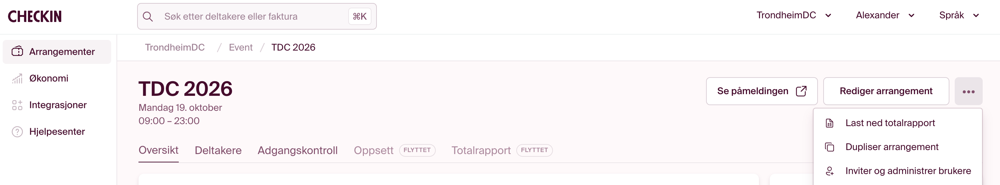

# Hent deltakerliste fra Checkin (med QR-id)

Innsjekk-appen trenger én rad per deltaker med **barcode** (= teksten i billettens QR-kode), pluss navn, firma og rolle. Den vanlige Excel-eksporten under **Deltakere** har *ikke* barcode. Bruk **totalrapporten** i stedet.

## Fremgangsmåte

1. Logg inn på [Checkin](https://app.checkin.no) som TrondheimDC.
2. Åpne arrangementet (f.eks. **TDC 2026**).
3. På oversiktssiden: klikk **⋯** til høyre for «Rediger arrangement».
4. Velg **Last ned totalrapport**.



Filen lastes ned som Excel. I Excel: **Lagre som → CSV UTF-8**. Kolonnen **Barcode** / **Strekkode** er QR-id-en. Overskrifter følger Checkin-språket (engelsk eller norsk) — begge støttes.

## Importer i innsjekk

```bash
pnpm import:attendees ./totalrapport.csv
```

Kommandoen **synces** på barcode (`id`). Navn, firma og stilling oppdateres; innsjekk og `check_events` beholdes for barcode som fortsatt er aktive. Avmeldte, venteliste og refunderte (med barcode) soft-slettes. Rader uten barcode telles som ignorert. Billetter uten firmanavn og stillingstittel er ikke fylt ut (navnet er bestillerens): de importeres uten navn, vises ikke i søk, og innsjekk ber om navnet ved skanning. E-post, telefon og adresse leses ikke inn.

## Ikke bruk dette

| Sted | Problem |
|---|---|
| Fanen **Deltakere** → Excel-ikon | Mangler barcode / QR-id |
| Fanen **Totalrapport** (merket «FLYTTET») | Nedlastingen ligger under **⋯**, ikke i fanen |

## Hva vi trenger fra rapporten

Map minst disse kolonnene inn i innsjekk-appen:

| Checkin (EN) | Checkin (NO) | Innsjekk |
|---|---|---|
| `Barcode` | `Strekkode` | `id` |
| `Name` (ellers first+last) | `Navn` (ellers fornavn+etternavn) | `name` |
| `Company` | `Firmanavn` (ellers egendefinert `Bedrift`) | `company` |
| `Job title` | `Stillingstittel` (ellers meningsfull `Billettype` / `Ticket`) | `role` |
| `Cancelled` | `Avmeldt` | soft-slett |
| `On waiting list` | `På venteliste` | soft-slett |

Én bestilling kan ha flere deltakere — derfor er barcode per person, ikke bestillingsnummer, det som gjelder.

## Oppdatering før arrangementet

Last ned ny totalrapport nær arrangementsdagen (og gjerne morgenen før), så siste påmeldinger og avmeldinger er med. Importer på nytt i innsjekk-appen.
